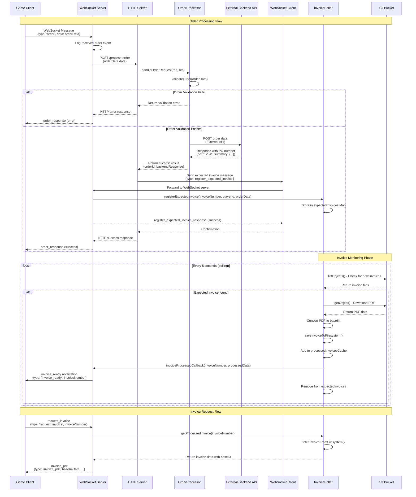

# Order Processing Sequence Diagram

This diagram shows the complete flow from receiving an 'order' message on the WebSocket to invoice processing.

## Key Components

### 1. **Order Processing Chain**
- Client sends order via WebSocket
- WebSocket server forwards to HTTP server
- HTTP server validates and processes via OrderProcessor
- OrderProcessor forwards to external backend API
- Response flows back through the chain

### 2. **Invoice Registration**
- HTTP server sends expected invoice registration to WebSocket server
- WebSocket server registers invoice in InvoicePoller
- InvoicePoller starts monitoring S3 for the invoice PDF

### 3. **Invoice Monitoring**
- InvoicePoller continuously polls S3 every 5 seconds
- When expected invoice PDF is found, it's processed and stored
- Client receives invoice_ready notification via WebSocket

### 4. **Invoice Retrieval**
- Client can request specific invoices via WebSocket
- InvoicePoller retrieves from filesystem and sends base64 data
- Client receives full invoice PDF data for display

## Error Handling

The flow includes comprehensive error handling at each step:
- Order validation errors
- Backend API communication failures
- WebSocket connection issues
- S3 access problems
- Invoice processing failures

Each error is properly logged and appropriate error responses are sent back to the client.
